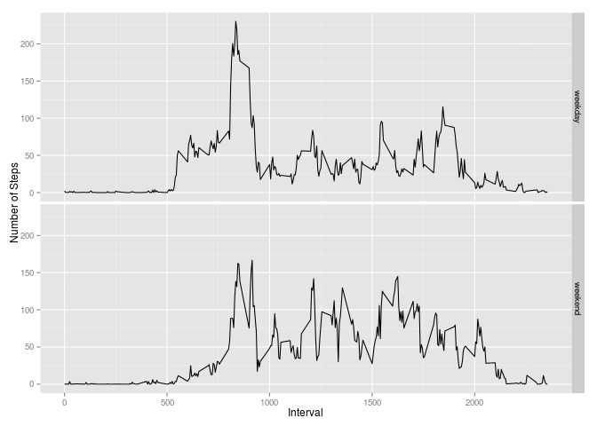

# Reproducible Research: Peer Assessment 1

Author: vtenhunen


## Loading and preprocessing the data

As described in the instructions of the assignment, _the assignment makes use of data from a personal activity monitoring device. This device collects data at 5 minute intervals through out the day. The data consists of two months of data from an anonymous individual collected during the months of October and November, 2012 and include the number of steps taken in 5 minute intervals each day._

_The variables included in this dataset are:_
* _steps: Number of steps taking in a 5-minute interval (missing values are coded as NA)_
* _date: The date on which the measurement was taken in YYYY-MM-DD format_
* _interval: Identifier for the 5-minute interval in which measurement was taken_

In this assignment _dplyr_ and _ggplot2_ are in use. The file have downloaded from the web, saved it to the working directory, unzipped it and read csv-file to the data frame. 


```r
# let's use dplyr and ggplot with this assignment
library(dplyr)
```

```
## 
## Attaching package: 'dplyr'
```

```
## The following objects are masked from 'package:stats':
## 
##     filter, lag
```

```
## The following objects are masked from 'package:base':
## 
##     intersect, setdiff, setequal, union
```

```r
library(ggplot2)

# Read data from the network
fileURL="https://d396qusza40orc.cloudfront.net/repdata%2Fdata%2Factivity.zip"
destfile="./datafile.zip"
      
      if(!file.exists(destfile)){
            # Get the data for the assignment
            download.file(fileURL, destfile)
      }

# unzip the file
      unzip(destfile)

# read data to the data frame
all_activitydata = read.csv("activity.csv", na.strings="NA", header = TRUE)

# fix the names
names(all_activitydata) <- c("Steps", "Date", "Interval")
```

Here is the summary of the data frame


```r
summary(all_activitydata)
```

```
##      Steps                Date          Interval     
##  Min.   :  0.00   2012-10-01:  288   Min.   :   0.0  
##  1st Qu.:  0.00   2012-10-02:  288   1st Qu.: 588.8  
##  Median :  0.00   2012-10-03:  288   Median :1177.5  
##  Mean   : 37.38   2012-10-04:  288   Mean   :1177.5  
##  3rd Qu.: 12.00   2012-10-05:  288   3rd Qu.:1766.2  
##  Max.   :806.00   2012-10-06:  288   Max.   :2355.0  
##  NA's   :2304     (Other)   :15840
```


## What is mean total number of steps taken per day?

A histogram of the total number of steps taken each day.


```r
# Aggregate data and remove missing values
stepsbyday <- aggregate(all_activitydata$Steps, by = list(all_activitydata$Date), sum, na.rm=TRUE)

# Modifications to names
names(stepsbyday) <- c("Date", "Steps")

# Histogram
barplot(stepsbyday$Steps, names.arg=stepsbyday$Date, xlab = "Date", ylab = "Number of Steps", ylim=c(0,25000))
```

\

The mean and median total number of steps taken per day


```r
stepmean <- round(mean(stepsbyday$Steps), 2)
stepmedian <- round(median(stepsbyday$Steps), 2)
```

Mean of total number of steps taken per day is `9354` and median of total number of steps taken per day is `10395`.

## What is the average daily activity pattern?

A time series plot (i.e. type = "l") of the 5-minute interval (x-axis) and the average number of steps taken, averaged across all days (y-axis):


```r
# aggregate data and remove NAs
averagesteps <- aggregate(x = all_activitydata$Steps, by = list(all_activitydata$Interval), FUN = mean, na.rm=TRUE)

# Names
names(averagesteps) <- c("Interval","Steps")

# plot the line
avgeragestepline <- ggplot(averagesteps, aes(Interval, Steps)) + 
      ggtitle("Average Steps by the 5-minute Interval") +
      geom_line()
avgeragestepline
```

\

5-minute interval, on average across all the days in the dataset, contains the maximum number of steps:


```r
# Find the maximum
maxsteps <- averagesteps[which.max(averagesteps$Steps),c("Interval")]

# Print it
maxsteps
```

```
## [1] 835
```

Interval which contain maximum number of steps is `835`.

## Imputing missing values

There are a number of days/intervals where there are missing values (coded as NA). The presence of missing days may introduce bias into some calculations or summaries of the data.

The total number of missing values in the dataset (i.e. the total number of rows with NAs):


```r
nrow(all_activitydata[is.na(all_activitydata$Steps),])
```

```
## [1] 2304
```

Total numbers of the rows with NAs is `2304`.


Strategy for filling in all of the missing values in the dataset based on following idea: Replace NAs by average 5-minute interval values which are presented in previous task (as _averagesteps_). Then we create a new data frame (*new_activitydata*) where the old column (with NAs) of *all_activitydata* has replaced by a new column of *averqagesteps*.


```r
# Create a new data frame
comp_activitydata <- merge(all_activitydata, averagesteps, by="Interval")

# If there is NAs, replace them with the average
comp_activitydata$Steps.x[is.na(comp_activitydata$Steps.x)] <- comp_activitydata$Steps.y[is.na(comp_activitydata$Steps.x)]

# Remove additional steps column
new_activitydata <- select(comp_activitydata, Interval, Date, Steps.x)

# Rename columns
names(new_activitydata) <- c("Interval", "Date", "Steps")
```

Then let's create histogram of the total number of steps taken each day.

```r
# Aggregate data
new_stepsbyday <- aggregate(x = new_activitydata$Steps, by = list(new_activitydata$Date), FUN = sum, na.rm=TRUE)

# fix the names
names(new_stepsbyday) <- c("Date", "Steps")

# Make a plot
barplot(new_stepsbyday$Steps, names.arg=new_stepsbyday$Date, xlab = "Date", ylab = "Number of Steps (imputed data)")
```

\

Mean and median total number of steps taken per day:

```r
# Calculate mean and median
newstepmean <- round(mean(new_stepsbyday$Steps), 2)
newstepmedian <- round(median(new_stepsbyday$Steps), 2)

# Print these
newstepmean
```

```
## [1] 10766.19
```

```r
newstepmedian
```

```
## [1] 10766.19
```

Mean of total number of steps taken per day is `10766` and nedian of total number of steps taken per day is `10766`. Mean and median are in this case equals.

_Do these values differ from the estimates from the first part of the assignment?_

Differences are quite small.

_What is the impact of imputing missing data on the estimates of the total daily number of steps?_

Means are little bit higher, but impact is limited.


## Are there differences in activity patterns between weekdays and weekends?

A new factor variable in the dataset with two levels – “weekday” and “weekend” indicating whether a given date is a weekday or weekend day.


```r
# Type of the date for POSIXct
new_activitydata$Date <- as.POSIXct(new_activitydata$Date) 

# Define weekday (if day is Saturday or Sunday, Wday is "weekend", otherwise "weekday")
new_activitydata$Wday <- ifelse(weekdays(new_activitydata$Date) == "Saturday" | weekdays(new_activitydata$Date) == "Sunday" ,"weekend","weekday")
```

Make a panel plot containing a time series plot (i.e. type = "l") of the 5-minute interval (x-axis) and the average number of steps taken, averaged across all weekday days or weekend days (y-axis). 


```r
# Aggregate values
averagesteps_int_wday_mean <- aggregate(x = new_activitydata$Steps, by = list(new_activitydata$Wday, new_activitydata$Interval), FUN = mean, na.rm = TRUE)

# Fix the names
names(averagesteps_int_wday_mean) <- c("Wday","Interval", "MeanSteps")

# Round values
averagesteps_int_wday_mean$MeanSteps <- round(averagesteps_int_wday_mean$MeanSteps, 2)

# Make a plot
average_iwm <- ggplot(averagesteps_int_wday_mean, aes(x = Interval, y = MeanSteps)) + 
      ylab("Number of Steps") + 
      geom_line() + 
      facet_grid(Wday~.)
average_iwm
```

\

Yes, there is some differences between weekday and weekend values. There is more steps on weekend with bigger interval numbers, which indicate that steps are taken later. On weekdays start of steps is also earlier and there is a peak at the beginning of the curve which indicates for example situations where people goes to work at the same time. 

NOTE: If there is not correct figure where is both plots (weekday and weekends), it is possible to find it by name _weekdayplot-1.png_ in folder _figure-html_ (in the _PA1-template-files_). Reason for this problem is language definitions; my computer use other language than english as a system language and even if *en_US.UTF-8* is defined for *Sys.setlocale* in RStudio, _Knit HTML_ does not use it.

